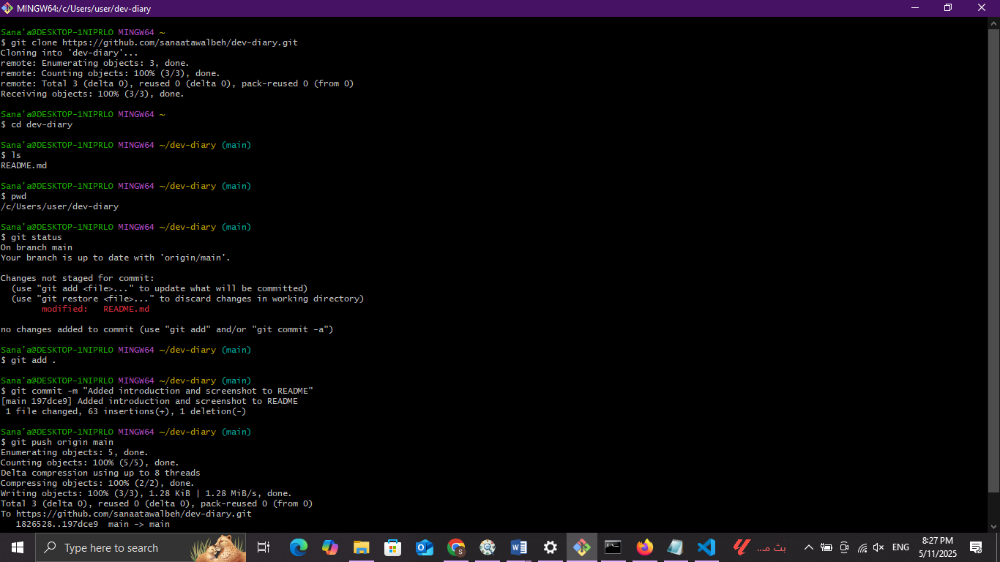

# My div diary

## Hello, I'm Sanaa Tawalbeh

I am a graduate of Hijjawi Faculty for Engineering Technology at Yarmouk University, with a degree in **Computer Engineering**. I have basic experience in ASP.NET Full Stack Development and I'm passionate about improving my skills by building practical projects and expanding my knowledge in the field.

### What I Learned - Dev Mindset

- **Keep learning** — *Technology always changes. Never stop learning.*
- **Split big problems** — *Break big tasks into small ones.*
- **Debug smart** — *Look for issues like a detective.*
- **Believe you can grow** — *You get better by trying, not by being perfect.*
- **Focus on the goal** — *Code is only good if it helps people.*
- **Keep it simple** — *Simple code is better than complex code.*
- **Make smart choices** — *Do the most important things first.*
- **Think about the future** — *Write clean code that’s easy to fix later.*
- **Make flexible code** — *Try to make your code easy to change.*
- **Ask for feedback early** — *Don’t wait too long to show your work.*
- **Work as a team** — *Talk, help, and learn from your teammates.*
- **Use clean design** — *Keep your code organized and tidy.*
- **Write readable code** — *Code should be easy to understand.*
- **Know how things work** — *Don’t just use tools, understand them.*
- **Automate boring stuff** — *Save time with scripts or tools.*
- **Done is better than perfect** — *Ship your code, then improve it later.*

### What I Learned - Command Line

- `pwd` — *Shows where you are in the computer (your folder path).*
- `mkdir` — *Makes a new folder.*
- `ls` — *Lists what's inside a folder.*
- `cd` — *Move to a different folder. Use `..` to go back.*
- `touch` — *Makes a new file.*
- **Filesystem** — *Like a tree. Folders can have more folders or files inside.*
- **Command line** — *A place where you can type to tell the computer what to do.*
- `clear` — *Cleans the screen.*
- `tab` — *Helps you finish typing (autocomplete).*
- `↑ ↓` — *Go through commands you typed before.*

  
*A screenshot of terminal commands I practiced.*
